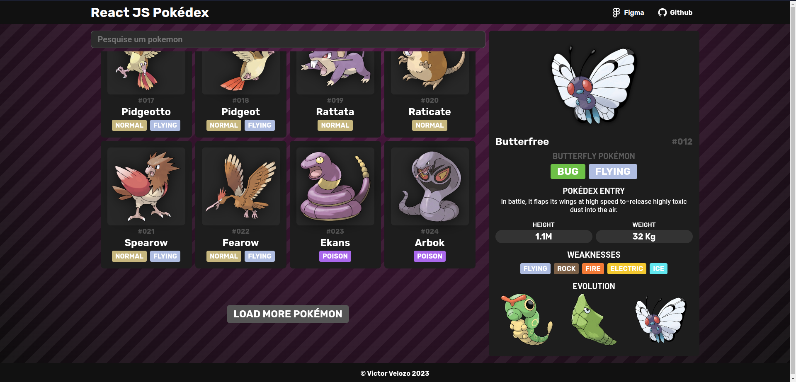

<h1 align="center">PokedexJS</h1>

<h3 align="center">
A simple pokedex display made in react js with <a href="https://pokeapi.co/docs/graphql">GraphQL PokeAPI</a> beta version.
</h3>

 

## About

PokedexJS it's a simple pokédex application that displays your favorite pocket monsters, made in React JS with [Vite](https://vitejs.dev).

## Installation

Project created with create-vite.

Clone this and the backend repository and then

1. Install dependencies with `npm install` or `yarn` in the terminal
2. Run it with `npm` or `yarn dev`

## Usage and Features

With local server running access `http://localhost:5173`

- Displays pokémon from every generation
- Displays pokédex entry in English
- Displays pokémon types and its weakness (based on type only, doesn't consider pokémon signature abilities)
- You can search pokémon name to display

Due to GraphQL API being in beta, there are some pokémon without dex entries, images or incorrect evolution order.

## Technologies

- Vite.js
- Apollo Client
- Graphql
- StyledComponents
- Eslint
- TypeScript

## Links

- [Figma](https://www.figma.com/file/QgQ7jZmtF7eYlKIO5re0YH/PokeJS?node-id=0%3A1&t=VB0722ZjecBMGtPv-1)
- [Live Demo](https://reactdex.onrender.com)
